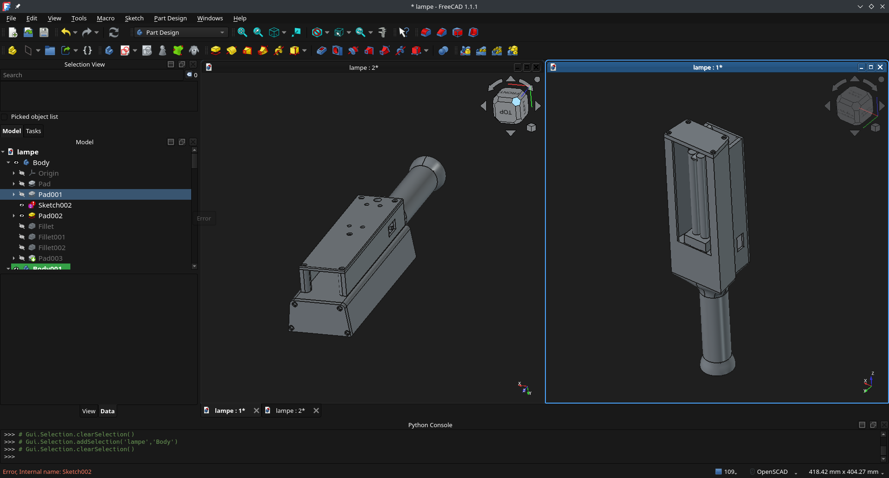
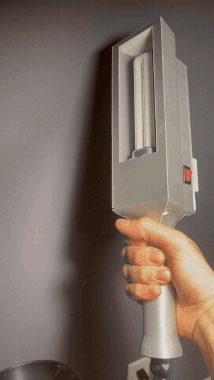
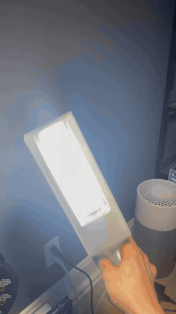

# Open UVB Lamp Prototype

Prototype narrowband UVB lamp using a Philips PL-S 9W/01/2P lamp, a G23 electromagnetic ballast, a FreeCAD-designed enclosure, and a mechanical relay controlled by a Seeed XIAO RP2040.

The project is documented in the context of localized narrowband UVB exposure research for psoriasis-related prototyping. It is not medical advice and does not claim to treat, cure, or diagnose psoriasis.

| Prototype handling | Visible lamp test |
| --- | --- |
|  |  |

The illuminated lamp shown above is a visible, non-UV G23 test lamp used to verify fit, wiring behavior, and demonstration footage without UV exposure.

> Project status: documented prototype. This repository is not a safety certification, a validated medical device, or a build guide for unqualified users.

## Critical Warning

This project combines 120 VAC mains voltage with a UVB source. UVB exposure can cause skin burns, eye injury, and long-term tissue damage. Mains voltage can kill. Do not reproduce this build without electrical competence, UV-opaque enclosure design, protective earth bonding, fusing, mechanical isolation, mains-to-low-voltage spacing, certified eye protection, and real UV output measurements.

Psoriasis phototherapy protocols should be set by qualified medical professionals. This prototype documentation is for technical transparency only.

The KiCad schematic is mainly a wiring and soldering aid for understanding the prototype. It is not a complete electrical simulation, a regulatory validation, a medical validation, or proof that the device is safe.

KiCad ERC/DRC checks can catch some connection errors, but they do not validate safety with mains voltage, ballasts, UVB lamps, or therapeutic use.

## Retained Design

The retained design is the mechanical-relay schematic:

- KiCad source: `kicad_uvb_project/uvb_controller/uvb_controller_mechanical_relay.kicad_sch`
- KiCad project: `kicad_uvb_project/uvb_controller/uvb_controller.kicad_pro`
- Local symbol library: `kicad_uvb_project/uvb_controller/uvb_custom.kicad_sym`
- Schematic PDF: `output/pdf/uvb_controller_mechanical_relay.pdf`

Older schematic variants are kept in `kicad_uvb_project/uvb_controller/archive/` for historical reference only.

## Repository Contents

- `CAD/`: FreeCAD source files, STEP model, and mechanical reference images.
- `kicad_uvb_project/`: KiCad schematic, relay BOM, placement notes, and connection maps.
- `sketch_relay_test/`: XIAO RP2040 relay test firmware.
- `XIAO_RELAY_TEST_SOFTWARE.md`: compile, flash, and serial test notes.
- `SAFETY.md`: essential safety notes.
- `digikey_bom_clean.csv`: public supplier-oriented BOM with personal sourcing links removed.
- `docs/media/`: README media assets, including the demo GIF.

## Reproducing the Prototype

The repository includes the core files needed to inspect and reproduce the documented prototype:

- Mechanical design in FreeCAD: `CAD/lampe.FCStd`, `CAD/CadLampe.FCStd`, `CAD/Fan_80x80x38_equivalent.step`, and `CAD/G23_lamp_dimensions.md`.
- Electrical wiring reference: `kicad_uvb_project/uvb_controller/uvb_controller_mechanical_relay.kicad_sch` and `output/pdf/uvb_controller_mechanical_relay.pdf`.
- KiCad custom symbols: `kicad_uvb_project/uvb_controller/uvb_custom.kicad_sym`.
- Parts list: `digikey_bom_clean.csv` and `kicad_uvb_project/BOM_mechanical_relay.csv`.
- Firmware: `sketch_relay_test/sketch_relay_test.ino`.
- Firmware test notes: `XIAO_RELAY_TEST_SOFTWARE.md`.
- Safety notes: `SAFETY.md`.

Vendor datasheets are referenced by URL in the BOM rather than copied into the repository.

## Firmware Test

The test firmware forces the relay OFF at boot and waits for a serial command:

- `on`: turns the relay on for 5 seconds.
- `pulse`: same as `on`.
- `off`: immediately turns the relay off.
- `status`: prints the current state.

Keep mains voltage disconnected during USB and firmware tests.

## Minimum Validation Before Use

Before any mains or UVB test, document at least:

- protective earth continuity to accessible metal parts;
- no continuity between mains `L/N` and logic `5V/GND`;
- fuse on the live conductor;
- UV-opaque enclosure and ventilation;
- thermal measurement;
- UVB irradiance measurement with a suitable meter;
- ideally, a 250-400 nm spectral measurement.

## Contributors

See `CONTRIBUTORS.md`.

## License

See `LICENSE.md`.

Proposed license split:

- Hardware, CAD, KiCad files, BOMs: CERN-OHL-P-2.0.
- Firmware: MIT.
- Documentation, photos, and videos: CC-BY-4.0.
